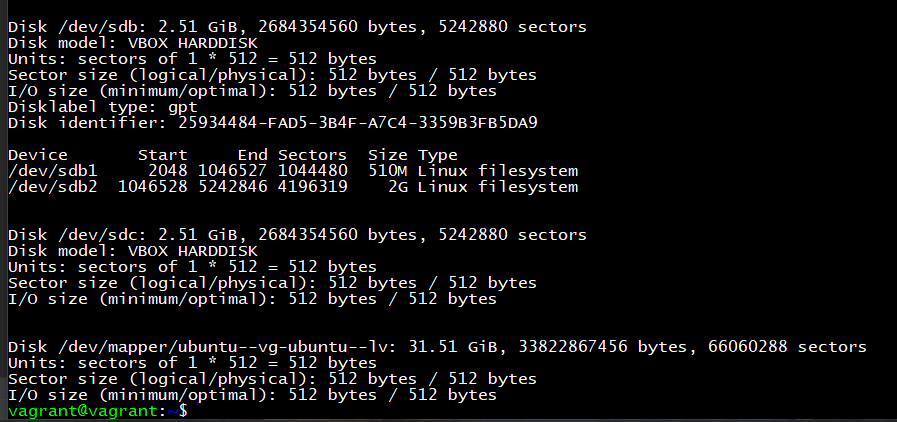

1. Узнайте о [sparse](https://ru.wikipedia.org/wiki/%D0%A0%D0%B0%D0%B7%D1%80%D0%B5%D0%B6%D1%91%D0%BD%D0%BD%D1%8B%D0%B9_%D1%84%D0%B0%D0%B9%D0%BB) (разряженных) файлах.

Разрежённый файл (англ. sparse file) — файл, в котором последовательности нулевых байтов[1] заменены на информацию об этих последовательностях (список дыр).

dd if=/dev/zero of=./sparse-file bs=1 count=0 seek=200G

или

truncate -s200G ./sparse-file

преобразование обычного файла в разрежённый (выполнение поиска дыр и записи их расположения (смещений и длин) в метаданные файла):

cp --sparse=always ./simple-file ./sparse-file

1. Могут ли файлы, являющиеся жесткой ссылкой на один объект, иметь разные права доступа и владельца? Почему?

Не могут.

Потому что жесткая ссылка копирует права доступа и владельца с файла на который ссылается. 

Нельзя менять права у одного и того же файла

1. Используя fdisk, разбейте первый диск на 2 раздела: 2 Гб, оставшееся пространство.

2. Используя sfdisk, перенесите данную таблицу разделов на второй диск.

3. Соберите mdadm RAID1 на паре разделов 2 Гб.

4. Соберите mdadm RAID0 на второй паре маленьких разделов.

4. Создайте 2 независимых PV на получившихся md-устройствах.

4. Создайте общую volume-group на этих двух PV.

4. Создайте LV размером 100 Мб, указав его расположение на PV с RAID0.

4. Создайте mkfs.ext4 ФС на получившемся LV.

4. Смонтируйте этот раздел в любую директорию, например, /tmp/new.

4. Поместите туда тестовый файл, например wget https://mirror.yandex.ru/ubuntu/ls-lR.gz -O /tmp/new/test.gz.

4. Прикрепите вывод lsblk.

4. Протестируйте целостность файла:

root@vagrant:~# gzip -t /tmp/new/test.gz
root@vagrant:~# echo $?
0
4. Используя pvmove, переместите содержимое PV с RAID0 на RAID1.

4. Сделайте --fail на устройство в вашем RAID1 md.

4. Подтвердите выводом dmesg, что RAID1 работает в деградированном состоянии.

4. Протестируйте целостность файла, несмотря на "сбойный" диск он должен продолжать быть доступен:

root@vagrant:~# gzip -t /tmp/new/test.gz
root@vagrant:~# echo $?
0
4. Погасите тестовый хост, vagrant destroy.

