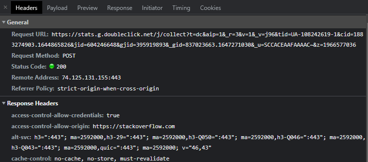
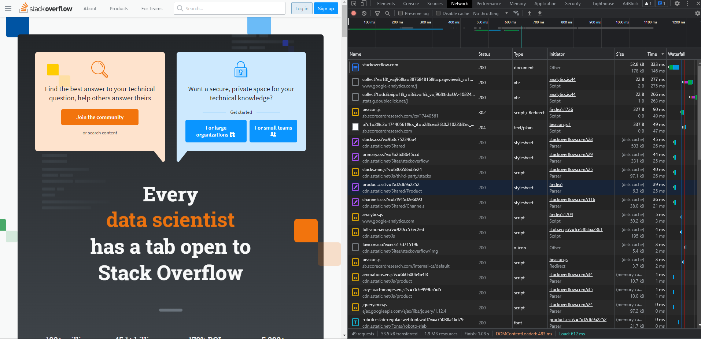

1. Работа c HTTP через телнет.
Подключитесь утилитой телнет к сайту stackoverflow.com telnet stackoverflow.com 80
отправьте HTTP запрос
GET /questions HTTP/1.0
HOST: stackoverflow.com
[press enter]
[press enter]
В ответе укажите полученный HTTP код, что он означает?

HTTP/1.1 301 Moved Permanently
cache-control: no-cache, no-store, must-revalidate
location: https://stackoverflow.com/questions

web сервер ответил кодом 301 имеется переход на https://stackoverflow.com/questions

1. Повторите задание 1 в браузере, используя консоль разработчика F12.
откройте вкладку Network
отправьте запрос http://stackoverflow.com
найдите первый ответ HTTP сервера, откройте вкладку Headers
укажите в ответе полученный HTTP код.

проверьте время загрузки страницы, какой запрос обрабатывался дольше всего?
приложите скриншот консоли браузера в ответ.

2. Какой IP адрес у вас в интернете?

vagrant@vagrant:~$ curl ifconfig.co.
5.227.27.8

3. Какому провайдеру принадлежит ваш IP адрес? Какой автономной системе AS? Воспользуйтесь утилитой whois

vagrant@vagrant:~$ whois -h whois.radb.net 5.227.27.8
route:          5.227.0.0/17
descr:          MTS Nizhniy Novgorod Stream network block
origin:         AS8580
mnt-by:         MTU-NOC
created:        2020-07-24T21:48:22Z
last-modified:  2020-07-24T21:48:43Z
source:         RIPE

4. Через какие сети проходит пакет, отправленный с вашего компьютера на адрес 8.8.8.8? Через какие AS? Воспользуйтесь утилитой traceroute

vagrant@vagrant:~$ traceroute -An 8.8.8.8
traceroute to 8.8.8.8 (8.8.8.8), 30 hops max, 60 byte packets
 1  10.0.2.2 [*]  0.395 ms  0.255 ms  0.176 ms
 2  * * *
 3  * * *
 4  * * *
 5  * * *
 6  * * *
 7  * * *
 8  * * *
 9  * * *
10  * * *
11  * * *
12  * * *
13  * * *
14  * * *
15  * * *
16  * * *
17  * * *
18  * * *
19  * * *
20  * * *
21  * * *
22  * * *
23  * * *
24  * * *
25  * * *
26  * * *
27  * * *
28  * * *
29  * * *
30  * * *

Не доходит он до 8.8.8.8 (добро пожаловать в 2022 год)

1. Повторите задание 5 в утилите mtr. На каком участке наибольшая задержка - delay?

2. Какие DNS сервера отвечают за доменное имя dns.google? Какие A записи? воспользуйтесь утилитой dig

vagrant@vagrant:~$ dig +short NS dns.google
ns1.zdns.google.
ns4.zdns.google.
ns3.zdns.google.
ns2.zdns.google.
vagrant@vagrant:~$ dig +short A dns.google
8.8.4.4
8.8.8.8

3. Проверьте PTR записи для IP адресов из задания 7. Какое доменное имя привязано к IP? воспользуйтесь утилитой dig

vagrant@vagrant:~$ dig +short -x 8.8.4.4
dns.google.
vagrant@vagrant:~$ dig +short -x 8.8.8.8
dns.google.

В качестве ответов на вопросы можно приложите лог выполнения команд в консоли или скриншот полученных результатов.