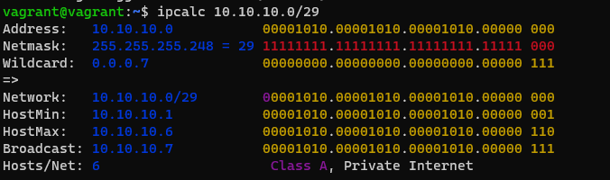

1. Проверьте список доступных сетевых интерфейсов на вашем компьютере. Какие команды есть для этого в Linux и в Windows?

2. Какой протокол используется для распознавания соседа по сетевому интерфейсу? Какой пакет и команды есть в Linux для этого?

Протокол LLDP
Пакет lldpd
Команда lldpctl

3. Какая технология используется для разделения L2 коммутатора на несколько виртуальных сетей? Какой пакет и команды есть в Linux для этого? Приведите пример конфига.

Технология называется VLAN (Virtual LAN).
Пакет в Ubuntu Linux - vlan

4. Какие типы агрегации интерфейсов есть в Linux? Какие опции есть для балансировки нагрузки? Приведите пример конфига.

5. Сколько IP адресов в сети с маской /29 ? Сколько /29 подсетей можно получить из сети с маской /24. Приведите несколько примеров /29 подсетей внутри сети 10.10.10.0/24.

8 адресов = 6 для хостов, 1 адрес сети и 1 широковещательный адрес.
Сеть с маской /24 можно разбить на 32 подсети с маской /29 Подсети будут такими: Network: 10.10.10.0/29 Network: 10.10.10.8/29 Network: 10.10.10.16/29 и т.д. до Network: 10.10.10.248/29

6. Задача: вас попросили организовать стык между 2-мя организациями. Диапазоны 10.0.0.0/8, 172.16.0.0/12, 192.168.0.0/16 уже заняты. Из какой подсети допустимо взять частные IP адреса? Маску выберите из расчета максимум 40-50 хостов внутри подсети.

Маска для диапазонов будет /26, она позволит подключить 62 хоста.

7. Как проверить ARP таблицу в Linux, Windows? Как очистить ARP кеш полностью? Как из ARP таблицы удалить только один нужный IP?

